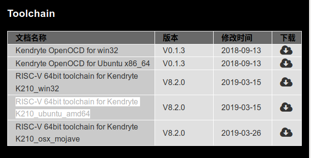
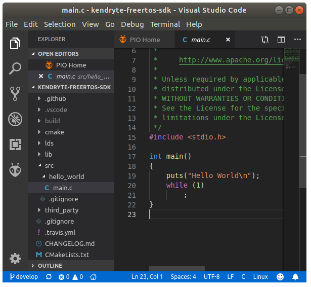
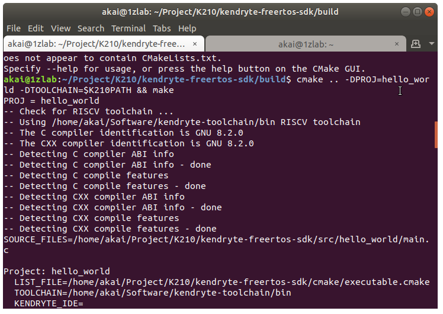
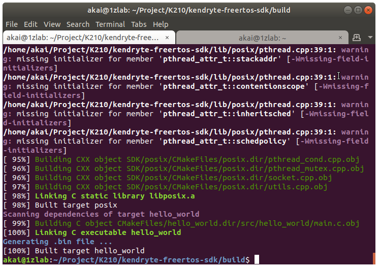
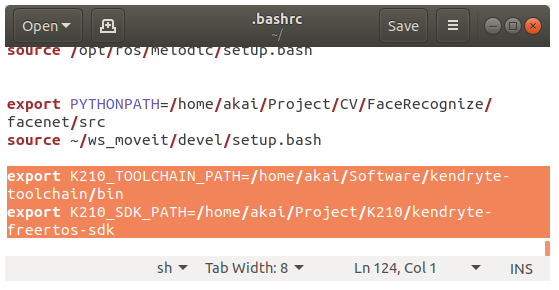
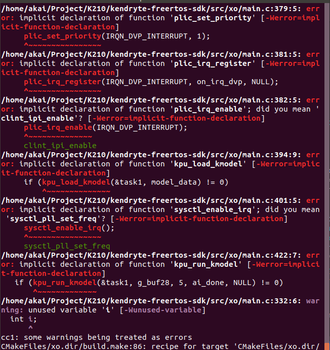

# K210工具链与源码编译


## 下载K210的工具链

在　[Kendryte官方下载界面](https://kendryte.com/downloads/) 里面的`Toolchain`工具包，根据自己的操作系统选择。

这里我选择的是`RISC-V 64bit toolchain for Kendryte K210_ubuntu_amd64` Ubuntu的版本.




下载后将下载的[kendryte-toolchain-ubuntu-amd64-8.2.0-20190213.tar.gz](https://s3.cn-north-1.amazonaws.com.cn/dl.kendryte.com/documents/kendryte-toolchain-ubuntu-amd64-8.2.0-20190213.tar.gz) 文件移动到一个文件夹下, 例如`~/Software`

接下来需要解压`tar.gz`文件

```
tar -zxvf kendryte-toolchain-ubuntu-amd64-8.2.0-20190213.tar.gz 
```


然后添加系统环境变量, 编辑`.bashrc`文件

```bash
gedit ~/.bashrc
```

末尾添加这一行，路径就填写你存放`kendryte-toolchain`的路径。

`akai` 是我的用户名, 需要改成自己的用户名

```bash
export K210_TOOLCHAIN_PATH=/home/akai/Software/kendryte-toolchain/bin
```

> 注: 必须填写全路径

保存后关闭`.bashrc`文件.

更新系统环境变量

```
source ~/.bashrc 
```


## 下载K210 FreeRTOS SDK

[Kendryte K210 FreeRTOS SDK](https://github.com/kendryte/kendryte-freertos-sdk)

使用Git下载克隆`K210 FreeRTOS SDK`

```
git clone https://github.com/kendryte/kendryte-freertos-sdk.git
```

下载完毕后, 进入Terminal.

```bash
$ pwd
/home/akai/Project/K210/kendryte-freertos-sdk
```

在`src`文件夹下创建你的工程，默认sdk里面自带了一个`hello_world` 例程。




那么接下来我们就开始尝试编译这个`hello_world`例程吧


创建一个`build`文件夹，用于存放编译后的二进制文件。

```bash
$ mkdir build
```

进入到`build`文件夹下

```bash
$ cd build
$ pwd
/home/akai/Project/K210/kendryte-freertos-sdk/build
```

接下来运行编译的指令, `-DPROJ` 代表当前要编译的工程名称，即`src`下工程的文件夹名称， 这里填写`hello_world` ， 另外`-DTOOLCHAIN` 后面跟工具链的`bin`文件夹路径, 因为之前添加了系统环境变量,所以可以填写为`$K210PATH`

```bash
cmake .. -DPROJ=hello_world -DTOOLCHAIN=$K210_TOOLCHAIN_PATH && make
```







当显示`100%`的时候，代表编译完成。

编译完成之后，在`build`文件夹下出现了两个文件

一个是`hello_world` , 另外一个是`hello_world.bin`


如果你使用JLink来运行或者调试程序，请使用`hello_world`

如果你想将代码烧录到开发板的Flash里面, 请使用`hello_world.bin`, 然后使用Flash工具烧录.


接下来我们还需要将SDK文件添加到系统路径里

```
$ gedit ~/.bashrc
```

添加下面这一行

```bash
export K210_SDK_PATH=/home/akai/Project/K210/kendryte-freertos-sdk
```



保存并退出

```
source ~/.bashrc
```


## 创建一个新的工程

我们在系统里随意找一个路径，创建一个文件夹， 名字叫做`k210-new-proj`

> 名字随便起

然后在文件夹里面创建一个`CMakeLists.txt`文件


## 烧录二进制文件到Flash


## 下载K210 Example

克隆工程: [sipeed/LicheeDan_K210_examples](https://github.com/sipeed/LicheeDan_K210_examples)

```
git clone https://github.com/sipeed/LicheeDan_K210_examples.git
```

这个工程里面存放了一些LicheeDan的例程。

注意, 这个工程里面的一些sh脚本不建议使用, 还需要自己修改, 另外Toolchain的工程结构也有较大变化。在K210的工具链下载页又下载不到旧版本的。


新版的API不兼容, 一堆报错，啊




 这里我们只是借用现有的工程结构还有一个类似的Example :  mnist

> 有时间我可以整理一下


## 项目编译


```
cmake . -DPROJ=mnist -DTOOLCHAIN=/home/akai/Software/kendryte-toolchain && make
```


## Reference

[MaixPy开发环境配置](https://github.com/sipeed/MaixPy/blob/master/ports/k210-freertos/README.md)