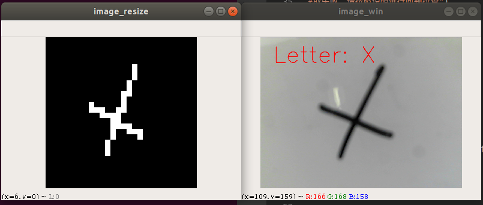
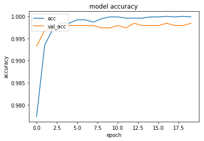
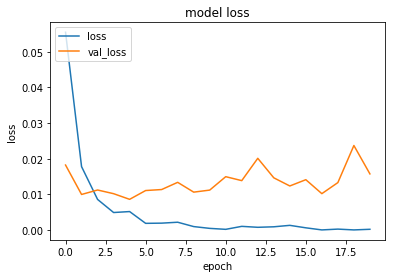

# 神经网络XO字符分类

[TOC]

## 概要




本节课将涉及如下知识点:

* 使用Keras创建神经网络模型
* 神经网络模型训练
* 超参数调参
* 模型序列化

* 通过opencv实时采集数据, 预处理之后传递给神经网络模型,模型给出预测结果


## 载入数据

序列化文件转换为数据集对象


```python
import pickle

dataset = None

with open('../../common/xo_dataset.bin', 'rb') as f:
    dataset = pickle.load(f)
```


```python
# 训练集图像向量
X_train = dataset['X_train']
# 训练集标签
y_train = dataset['y_train']
# 测试集图像向量
X_test = dataset['X_test']
# 测试集标签
y_test = dataset['y_test']
```

## 数据预处理


```python
import numpy as np
```

输入数据格式转换为float32


```python
X_train = X_train.astype('float32')
X_test = X_test.astype('float32')
```

归一化，数据缩放在0-1之间


```python
X_train = X_train / 255.0
X_test = X_test / 255.0
```

Label转换为one-hot格式


```python
from keras.utils import np_utils

NB_CLASSES = 2  # 输出的类的个数　(X or O)
Y_train = np_utils.to_categorical(y_train, NB_CLASSES)
Y_test = np_utils.to_categorical(y_test, NB_CLASSES)
```

    Using TensorFlow backend.


## 定义神经网络模型


```python
from keras.models import Sequential
from keras.layers.core import Dense, Dropout, Activation
```


```python
# 输入向量的维度
RESHAPED = 784
# 每层隐藏层神经元的个数
N_HIDDEN = 128
# DROPOUT的比例
DROPOUT = 0.3
```


```python
model = Sequential()
# 第一层隐藏层 全连接层
model.add(Dense(N_HIDDEN, input_shape=(RESHAPED,)))
# Relu激活层
model.add(Activation('relu'))
# Dropout层，随机删除神经元
# 网络表现力强，而且可以防止过拟合
model.add(Dropout(DROPOUT))
# 第二层隐藏层 全连接层
model.add(Dense(N_HIDDEN))
# Relu激活层
model.add(Activation('relu'))
# Dropout层，随机删除神经元
model.add(Dropout(DROPOUT))
# 全连接层，两个神经元　与输出尺寸一致
model.add(Dense(NB_CLASSES))
# Softmax正规化
# 使得输出结果范围在0-1之间, 而且所有的输出层结果数值相加=1
# 相当于每个输出代表是这个类的概率
model.add(Activation('softmax'))
model.summary()
```

    _________________________________________________________________
    Layer (type)                 Output Shape              Param #   
    =================================================================
    dense_4 (Dense)              (None, 128)               100480    
    _________________________________________________________________
    activation_4 (Activation)    (None, 128)               0         
    _________________________________________________________________
    dropout_3 (Dropout)          (None, 128)               0         
    _________________________________________________________________
    dense_5 (Dense)              (None, 128)               16512     
    _________________________________________________________________
    activation_5 (Activation)    (None, 128)               0         
    _________________________________________________________________
    dropout_4 (Dropout)          (None, 128)               0         
    _________________________________________________________________
    dense_6 (Dense)              (None, 2)                 258       
    _________________________________________________________________
    activation_6 (Activation)    (None, 2)                 0         
    =================================================================
    Total params: 117,250
    Trainable params: 117,250
    Non-trainable params: 0
    _________________________________________________________________


## 训练模型


```python
from keras.optimizers import RMSprop
#　当一个完整的数据集通过了神经网络一次并且返回了一次，这个过程称为一个 epoch。
NB_EPOCH = 20
# 当一个 epoch 对于计算机而言太庞大的时候，就需要把它分成多个小块，每个小块称之为一个batch
# BATCH_SIZE 是一个 batch 中的样本总数
BATCH_SIZE = 128
# optimizer参数优化器　效果比随机梯度下降(SGD)好
OPTIMIZER = RMSprop()

VERBOSE = 1
# 分隔验证数据比例
# 从训练数据选取20%作为验证数据
# 注: 调整超参数的时候，必须使用超参数专用的确认数据. 用于调整超参数的数据，一般称之为超参数
VALIDATION_SPLIT=0.2 # how much TRAIN is reserved for VALIDATION
```


```python
# 模型编译
# 损失函数为种类交叉熵　Categorical Crossentropy
# metrics 评价函数用于评估当前训练模型的性能 这里标准选用了准确率
model.compile(loss='categorical_crossentropy',
              optimizer=OPTIMIZER,
              metrics=['accuracy'])

# 数据拟合，记录保存在history中
history = model.fit(X_train, Y_train,
                    batch_size=BATCH_SIZE, epochs=NB_EPOCH,
                    verbose=VERBOSE, validation_split=VALIDATION_SPLIT)
# 模型评估，得分存在score里面
score = model.evaluate(X_test, Y_test, verbose=VERBOSE)
print("\nTest score:", score[0])
print('Test accuracy:', score[1])

```

    Train on 7680 samples, validate on 1920 samples
    Epoch 1/20
    7680/7680 [==============================] - 1s 80us/step - loss: 0.0555 - acc: 0.9773 - val_loss: 0.0182 - val_acc: 0.9932
    Epoch 2/20
    7680/7680 [==============================] - 0s 48us/step - loss: 0.0178 - acc: 0.9935 - val_loss: 0.0100 - val_acc: 0.9969
    
    ......
    
    Epoch 19/20
    7680/7680 [==============================] - 0s 45us/step - loss: 2.9840e-05 - acc: 1.0000 - val_loss: 0.0237 - val_acc: 0.9979
    Epoch 20/20
    7680/7680 [==============================] - 0s 45us/step - loss: 2.0588e-04 - acc: 0.9999 - val_loss: 0.0157 - val_acc: 0.9984
    1600/1600 [==============================] - 0s 49us/step
    
    Test score: 0.03704454694731453
    Test accuracy: 0.99625


## 模型训练可视化

可视化训练结果的目的，主要是为了观察超参数，模型是否产生了过拟合的现象


```python
# list all data in history
print(history.history.keys())
```

    dict_keys(['val_loss', 'val_acc', 'loss', 'acc'])


历史记录里面有四个指标
* `acc` 测试集的准确率
* `val_acc` 验证集的准确率
* `loss` 训练集上的loss
* `val_loss` 验证集上的loss


```python
import matplotlib.pyplot as plt

# summarize history for accuracy
plt.plot(history.history['acc'])
plt.plot(history.history['val_acc'])
plt.title('model accuracy')
plt.ylabel('accuracy')
plt.xlabel('epoch')
plt.legend(['acc', 'val_acc'], loc='upper left')
plt.show()
# summarize history for loss
plt.plot(history.history['loss'])
plt.plot(history.history['val_loss'])
plt.title('model loss')
plt.ylabel('loss')
plt.xlabel('epoch')
plt.legend(['loss', 'val_loss'], loc='upper left')
plt.show()
```








## 超参数调优

超参数就是人为预先设定的参数，例如：
1. EPOCH的大小
2. BATCH的大小
3. 隐藏层神经元的个数
4. 隐藏层的层数
5. 优化器的选择
6. DROPOUT的比例
等等．

超参数优化就是尝试不同的超参数组合，找到得分最高的那个．


```python
NB_EPOCH = 3
BATCH_SIZE = 135
```


```python
# 模型编译
# 损失函数为种类交叉熵　Categorical Crossentropy
# metrics 评价函数用于评估当前训练模型的性能 这里标准选用了准确率
model.compile(loss='categorical_crossentropy',
              optimizer=OPTIMIZER,
              metrics=['accuracy'])

# 数据拟合，记录保存在history中
history = model.fit(X_train, Y_train,
                    batch_size=BATCH_SIZE, epochs=NB_EPOCH,
                    verbose=VERBOSE, validation_split=VALIDATION_SPLIT)
# 模型评估，得分存在score里面
score = model.evaluate(X_test, Y_test, verbose=VERBOSE)
print("\nTest score:", score[0])
print('Test accuracy:', score[1])
```

    Train on 7680 samples, validate on 1920 samples
    Epoch 1/3
    7680/7680 [==============================] - 1s 100us/step - loss: 9.4463e-07 - acc: 1.0000 - val_loss: 0.0157 - val_acc: 0.9990
    Epoch 2/3
    7680/7680 [==============================] - 0s 45us/step - loss: 1.1925e-07 - acc: 1.0000 - val_loss: 0.0158 - val_acc: 0.9990
    Epoch 3/3
    7680/7680 [==============================] - 0s 45us/step - loss: 1.2068e-07 - acc: 1.0000 - val_loss: 0.0164 - val_acc: 0.9990
    1600/1600 [==============================] - 0s 51us/step
    
    Test score: 0.047438159837622604
    Test accuracy: 0.99625


微调后，虽然测试集上的准确率没有发生太大变化，还是`0.99625`, 但是大幅度降低了训练次数还有训练时间．


## 模型序列化


```python
with open('../../common/nn_model.bin', 'wb') as f:
    pickle.dump(model, f)
```


## 模型实时测试

通过USB摄像头采集图像, OpenCV采集图像, 图像预处理, 最后传递给神经网络模型, 模型给出预测结果, 将预测字符显示到窗口.

>  注:　效果视频见: ./video/神经网络XO识别效果视频.mkv


**完整源码**

```python
'''
OpenCV从USB摄像头读入图片,通过神经网络模型实时的对当前的棋子进行分类.
'''
import cv2
import numpy as np
import keras
from keras.models import load_model

# 初始化Capture
cap = cv2.VideoCapture(1)
cap.set(cv2.CAP_PROP_FRAME_WIDTH,  800)
cap.set(cv2.CAP_PROP_FRAME_HEIGHT, 600)
cv2.namedWindow('image_win',flags=cv2.WINDOW_NORMAL | cv2.WINDOW_KEEPRATIO | cv2.WINDOW_GUI_EXPANDED)
cv2.namedWindow('image_resize',flags=cv2.WINDOW_NORMAL | cv2.WINDOW_KEEPRATIO | cv2.WINDOW_GUI_EXPANDED)

# 载入keras模型
nn_model = load_model('../../common/nn_model.h5')
# label与字母之间的映射
label_letter_map = ['O', 'X']

def img_bin2vect(img_bin):
    '''28x28的二值化图像转换为784的向量'''
    tmp_img = img_bin.T
    vect = tmp_img.reshape(784).astype('float32')/255.0
    print('Shape : vect.shape: {}'.format(vect.shape))
    return vect

while(True):
    ## 逐帧获取画面
    # 如果画面读取成功 ret=True，frame是读取到的图片对象(numpy的ndarray格式)
    ret, frame = cap.read()

    if not ret:
        # 如果图片没有读取成功
        print("图像获取失败，请按照说明进行问题排查")
        break


    # 画布
    canvas = np.copy(frame)
    # 将BGR彩图变换为灰度图
    frame = cv2.cvtColor(frame, cv2.COLOR_BGR2GRAY)
    # 图像缩放为28x28
    frame_resize = cv2.resize(frame, (28, 28))
    # 图像二值化
    frame_binary = cv2.inRange(frame_resize, 0, 125)
    # 转换为向量
    result = nn_model.predict(np.array([img_bin2vect(frame_binary)]))[0]
    # 判断所属类别
    label = np.argmax(result)
    letter = label_letter_map[label]
    print('识别结果: {}'.format(letter))
    # 画布上绘制字符
    cv2.putText(canvas, text="Letter: {}".format(letter), org=(50, 100), 
        fontFace=cv2.FONT_HERSHEY_SIMPLEX, 
        fontScale=3, 
        thickness=2,
        lineType=cv2.LINE_AA, 
        color=(0, 0, 255))
    
    # 更新窗口“image_win”中的图片
    cv2.imshow('image_win', canvas)
    cv2.imshow('image_resize', frame_binary)
    # 等待按键事件发生 等待1ms
    key = cv2.waitKey(1)
    if key == ord('q'):
        # 如果按键为q 代表quit 退出程序
        print("程序正常退出...Bye 不要想我哦")
        break
    elif key == ord('c'):
        ## 如果c键按下，则进行图片保存
        # 写入图片 并命名图片为 图片序号.png
        cv2.imwrite("{}.png".format(img_count), frame)
        print("截图，并保存为  {}.png".format(img_count))
        # 图片编号计数自增1
        img_count += 1

# 释放VideoCapture
cap.release()
# 销毁所有的窗口
cv2.destroyAllWindows()
```


## Reference

Keras深度学习实战, Antonio Gulli, Sujit Pal

[神经网络训练中，傻傻分不清Epoch、Batch Size和迭代](https://www.jiqizhixin.com/articles/2017-09-25-3
)

[keras深度学习框架输出acc/loss,val_acc/val_loss，什么意思？](https://www.zhihu.com/question/58200419)
